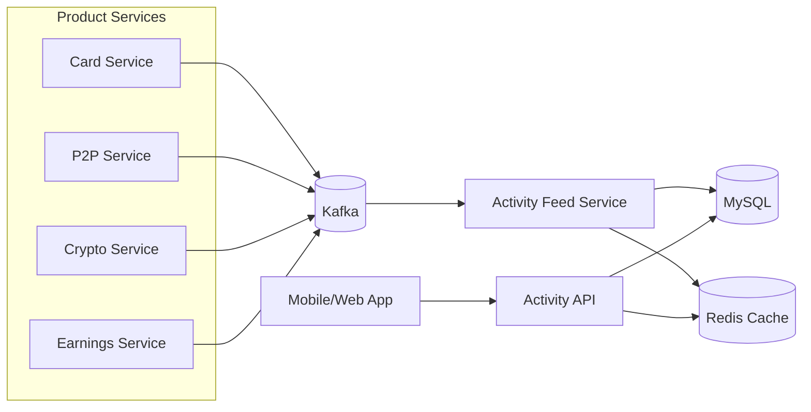
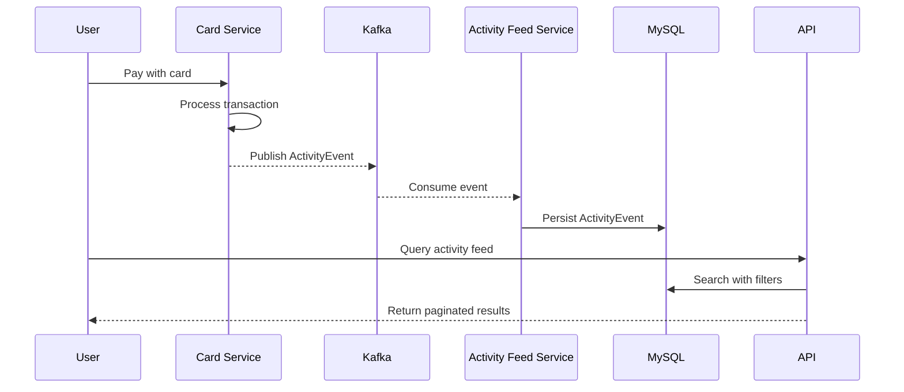

# Architecture

## Overview

Unified activity feed service that consolidates financial transactions from multiple product microservices (Card, P2P, Crypto, Earnings) into a single, searchable feed.

## System Architecture

## Event Flow

## Components

### Activity Feed Service
- **Ingestion**: Kafka consumer for real-time event processing
- **Storage**: MySQL with JSON column for flexible metadata
- **Query**: JPA repository with JSON_EXTRACT for metadata search
- **Caching**: Redis for first page (page=0) to reduce DB load

### Data Model
- **ActivityEvent**: Canonical representation with standard fields (userId, product, type, status, currency, amount) and flexible JSON metadata
- **Metadata**: Stores product-specific fields (merchantName, peerName, cardLast4, etc.)

### API
- **GET /api/v1/activity**: List with filtering, search, pagination
- **GET /api/v1/activity/{id}**: Detail view with full metadata

## Scalability Considerations

**Current Implementation:**
- MySQL JSON functions for metadata search (JSON_EXTRACT)
- Suitable for moderate volumes (thousands to low millions of records)
- Indexed queries on standard fields (userId, product, status, currency)

**Production Scale:**
- For high-volume scenarios (millions+ records), consider OpenSearch/Elasticsearch integration
- Current search uses JSON_EXTRACT + LIKE which doesn't scale efficiently
- Recommended: Hybrid approach - MySQL for standard filters, search engine for text search

## Technology Stack

- **Framework**: Spring Boot 4.0
- **Database**: MySQL 8.0+ (JSON support)
- **Messaging**: Kafka (event ingestion)
- **Cache**: Redis (optional)
- **Language**: Java 17
